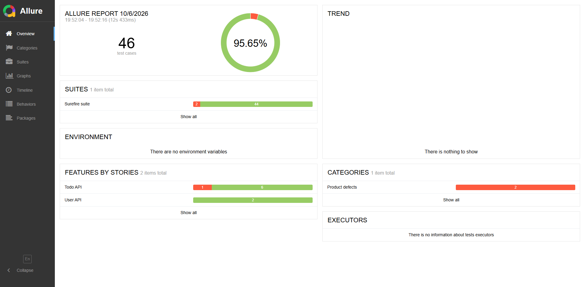
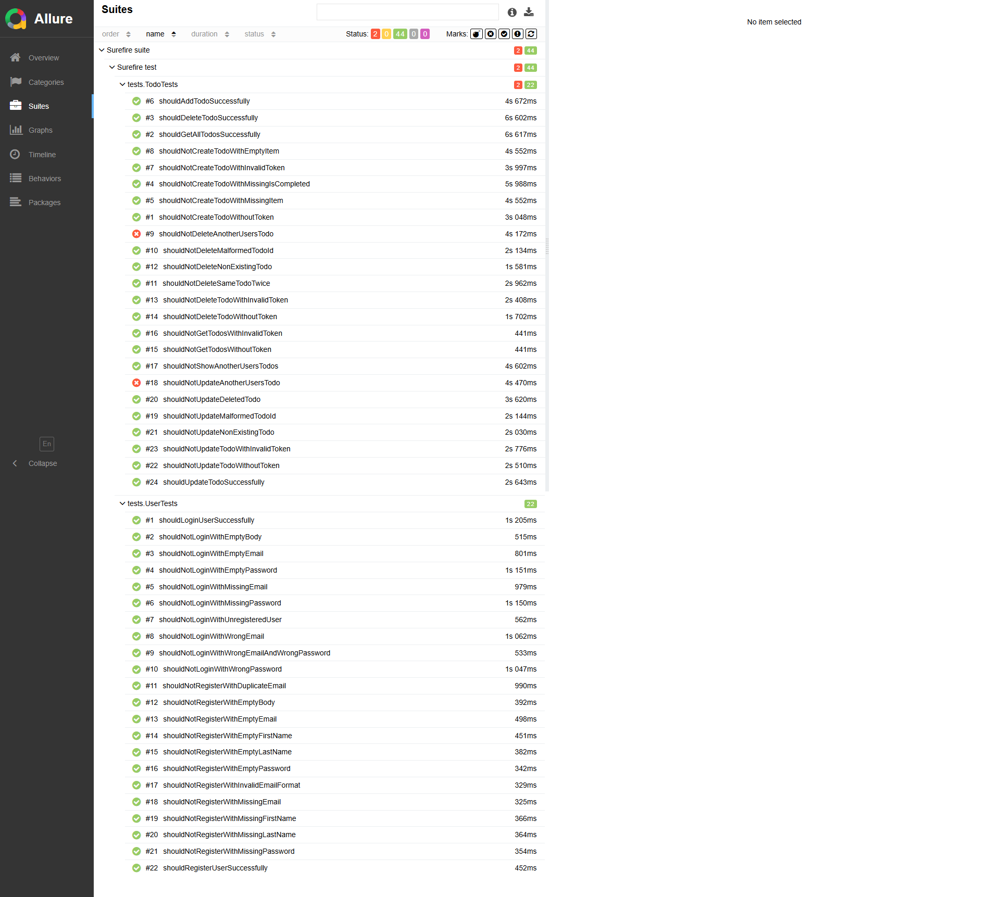

# QA Cart REST Assured API Automation Framework

## 1. Project Overview

This is a REST Assured API automation framework for the QA Cart Todo API. It uses Java, TestNG, Maven, Jackson, DataFaker, and Allure to cover positive, negative, authentication, authorization, validation, and security-focused API scenarios.

The framework intentionally keeps assertions in the test layer and uses reusable steps, API classes, models, routes, request specifications, and environment configuration to keep test scenarios readable.

## 2. Application Under Test

Application: QA Cart Todo API

Base URL:

```text
https://todo.qacart.com
```

Authentication is handled dynamically using the `access_token` returned from the Login API. Authentication tokens, user IDs, and task IDs are not hardcoded.

## 3. Tech Stack

- Java 21
- Maven
- TestNG
- REST Assured
- Jackson
- DataFaker
- Allure TestNG
- GitHub Actions

## 4. Framework Architecture

```text
Tests
  |
  v
Steps
  |
  v
API Classes
  |
  v
RequestSpec / Routes / Config
  |
  v
QA Cart API
  |
  v
Response
  |
  v
Assertions
```

Responsibilities:

- Tests = scenarios and assertions
- Steps = reusable flows
- API = sends HTTP requests
- Models = request/response POJOs
- Routes = endpoint paths
- Specs = shared REST Assured configuration
- Config = environments and base URLs

## 5. Project Structure

```text
.
|-- .github/workflows/api-tests.yml
|-- pom.xml
|-- README.md
|-- src/test/java
|   |-- apis
|   |-- config
|   |-- models
|   |-- routes
|   |-- specs
|   |-- steps
|   `-- tests
`-- src/test/resources
    |-- allure.properties
    `-- config.properties
```

## 6. API Endpoints

```text
POST   /api/v1/users/register
POST   /api/v1/users/login
POST   /api/v1/tasks
GET    /api/v1/tasks
PUT    /api/v1/tasks/{taskId}
DELETE /api/v1/tasks/{taskId}
```

## 7. Test Coverage

User API:

- Register
- Login

Todo API:

- Create Todo
- Get Todos
- Update Todo
- Delete Todo
- Authentication
- Authorization
- Payload Validation

The suite currently contains 46 tests.

## 8. Authentication Flow

```text
Generate random user
Register user
Login user
Extract access_token
Use token in Todo API requests
Validate response
```

Users are generated dynamically with DataFaker. Test execution does not depend on static accounts, hardcoded access tokens, hardcoded user IDs, or hardcoded task IDs.

## 9. Configuration

Main configuration file:

```text
src/test/resources/config.properties
```

Example:

```properties
env=test
base.url.test=https://todo.qacart.com
route.register=/api/v1/users/register
route.login=/api/v1/users/login
route.todos=/api/v1/tasks
ssl.relaxed=true
```

The active environment can be overridden with Maven:

```bash
mvn clean test -Denv=test
```

The base URL can also be overridden with:

```bash
mvn clean test -Dbase.url=https://todo.qacart.com
```

Allure results are standardized here:

```text
src/test/resources/allure.properties
```

```properties
allure.results.directory=target/allure-results
```

## 10. How to Run Tests

From the project root:

```bash
mvn clean test
```

Current expected result:

```text
Tests run: 46
Failures: 2
Errors: 0
Skipped: 0
```

The build currently fails because two authorization tests expose confirmed product/security defects.

## 11. Allure Reporting

Allure result files are written to:

```text
target/allure-results
```

Run tests:

```bash
mvn clean test
```

View report directly:

```bash
allure serve target/allure-results
```

Generate persistent report:

```bash
allure generate target/allure-results -o target/allure-report --clean
```

Open generated report:

```bash
allure open target/allure-report
```

Command meanings:

- `allure serve` generates a temporary report and opens it.
- `allure generate` creates a persistent HTML report.
- `allure open` opens a previously generated report.

Do not run Allure against `./allure-results`; this project writes results under `target/allure-results`.

## 12. Latest Test Execution

Latest known execution:

```text
Tests run: 46
Passed: 44
Failed: 2
Skipped: 0
```

Known failing tests:

- `shouldNotUpdateAnotherUsersTodo`
- `shouldNotDeleteAnotherUsersTodo`

These failures are valid security findings. They must not be skipped, weakened, or rewritten just to make the build pass.

## 13. Security Findings

### Broken Object Level Authorization (BOLA / IDOR)

Finding 1: User B can update User A's Todo.

- Actual response: HTTP 200
- Expected: The API should reject unauthorized access, usually with HTTP 403 or another secure resource-hiding response depending on application design.

Finding 2: User B can delete User A's Todo.

- Actual response: HTTP 200
- Expected: The API should reject unauthorized access, usually with HTTP 403 or another secure resource-hiding response depending on application design.

Confirmed working isolation:

- User B cannot see User A's Todo through `GET /api/v1/tasks`.
- The cross-user GET isolation test passes correctly.

Additional API validation/error-handling observation:

- Malformed Todo ID currently returns HTTP 500.
- A malformed client-provided ID should normally be handled with validation rather than an internal server error.

## 14. CI/CD

GitHub Actions workflow:

```text
.github/workflows/api-tests.yml
```

The workflow:

- Uses Java 21.
- Runs `mvn clean test`.
- Preserves Maven failure visibility.
- Uploads Surefire reports even when tests fail.
- Uploads Allure results from `target/allure-results` even when tests fail.
- Does not mark the known security failures as passing.
- Does not contain hardcoded tokens or credentials.

## 15. Key Framework Principles

- Do not redesign the framework unnecessarily.
- Keep assertions in the tests.
- Do not remove or weaken existing assertions.
- Generate users dynamically.
- Obtain `access_token` dynamically through the Login API.
- Do not hardcode JWTs, bearer tokens, user IDs, or task IDs.
- Keep routes centralized.
- Keep REST Assured request configuration shared.
- Keep test behavior separate from reporting metadata.
- Keep known product/security defects visible.

## Allure Test Report

Latest execution:

- Total Tests: 46
- Passed: 44
- Failed: 2
- Skipped: 0
- Pass Rate: 95.65%

The two failed tests expose confirmed cross-user authorization defects (BOLA / IDOR).

### Overview



### Test Suites


